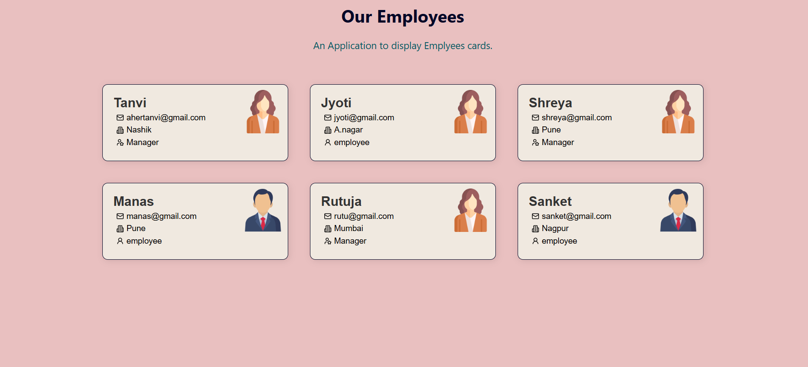

# 👥 Our Employees – React Card Display App

An elegant React application that dynamically displays employee information using reusable card components. Built with JSX and powered by array mapping, this project demonstrates clean UI design and foundational React concepts.

## 🚀 Features

- Displays employee details: name, email, location, and role
- Gender-based avatar icons for visual distinction
- Responsive layout with subtle shadow effects
- Clean separation of data and presentation logic
- Styled with a soft pink background and white card elements

## 🧠 What I Learned

- ✅ How to structure a React app using functional components and JSX
- ✅ How to map over an array of objects to render dynamic UI elements
- ✅ How to pass props to components for modular design
- ✅ How to conditionally render icons based on employee attributes
- ✅ How to style components for a polished, user-friendly interface

## 🛠️ Tech Stack

| Technology | Purpose |
|------------|---------|
| React (JSX) | UI rendering and component structure |
| CSS        | Styling and layout |
| JavaScript | Logic and data mapping |

## 📦 Installation

## OUTPUT

```bash
git clone https://github.com/your-username/employee-cards-app
cd employee-cards-app
npm install
npm start
